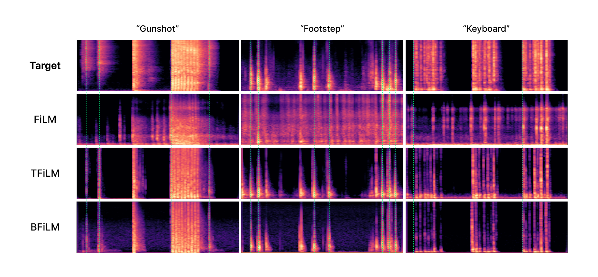

 

# Event-guided Generated Samples

Figure 1 and following demo samples contain the target samples, along with the corresponding 3 generated samples following each conditioning method. The first row is the sounds used to extract targeting event timing features. Subsequent rows are the generated results in different conditioning blocks (FiLM, TFiLM, and BFiLM). Columns for different sound categories (Gunshot, Footstep, and Keyboard)

    
    <em text-align="center">Figure 1: Generated sound in Mel-spectrogram with conditioning target event timing feature. As shown in the spectrograms, it can be observed that FiLM exhibits the occurrence of unclear sounds that are not aligned with the timing of the target samples. In contrast, the other two methods demonstrate excellent synchronization of timing which means that temporal FiLM and block FiLM outperform the original method.</em>

 

<table>
    <tr>
        <th></th>
        <th>GunShot</th>
        <th>Footstep</th>
        <th>Sneeze/Cough</th>
    </tr>
    <tr>
        <td>Target</td>
        <td><audio src="public/audios/097_gunshot.wav" controls></audio></td>
        <td><audio src="public/audios/094_footstep.wav" controls></audio></td>
        <td><audio src="public/audios/014_sneeze_cough.wav" controls></audio></td>
    </tr>
    <tr>
        <td>FiLM</td>
        <td><audio src="public/audios/097_gunshot_Film.wav" controls></audio></td>
        <td><audio src="public/audios/094_footstep_Film.wav" controls></audio></td>
        <td><audio src="public/audios/014_sneeze_cough_Film.wav" controls></audio></td>
    </tr>
    <tr>
        <td>TFiLM</td>
        <td><audio src="public/audios/097_gunshot_TFilm.wav" controls></audio></td>
        <td><audio src="public/audios/094_footstep_TFilm.wav" controls></audio></td>
        <td><audio src="public/audios/014_sneeze_cough_TFilm.wav" controls></audio></td>
    </tr>
    <tr>
        <td>BFiLM</td>
        <td><audio src="public/audios/097_gunshot_BFilm.wav" controls></audio></td>
        <td><audio src="public/audios/094_footstep_BFilm.wav" controls></audio></td>
        <td><audio src="public/audios/014_sneeze_cough_BFilm.wav" controls></audio></td>
    </tr>
</table>

 

---

# User Input Condition

Revisiting the motivation, creating Foley sounds manually is challenging and labor-intensive work. Therefore, the ultimate goal of this study is automating the Foley sound synthesis to allow anyone to easily generate sounds. 

However, in real-world applications, directly inputting event timing features, such as power and RMS, is not straightforward for users. In this manner, receiving the audio that can serve as a reference of event timings and extracting its event timing features to use as sampling conditions would be more intuitive. 

To demonstrate that our model performs well in such use cases, we conducted experiments using various types of sound(e.g. clapping, voice) as timing condition references. We manually recorded target samples delivering the desired timing points and then these recorded sounds are used as event timing conditions to generate sounds in different categories.

## 1. Clap

When target sample, which indicate when the events should occur, is recorded by clapping.

<video width="80%" controls>
  <source src="public/videos/demo.mp4" type="video/mp4">
  Your browser does not support the video tag.
</video>

## 2. Voice

When target sample is recorded with human voices.

<table>
    <tr>
        <th>DogBark</th>
        <th>GunShot</th>
        <th>MovingMotorVehicle</th>
    </tr>
    <tr>
        <td><video class="small_video" controls><source src="public/videos/dogbark.mp4" type="video/mp4"></video></td>
        <td><video class="small_video" controls><source src="public/videos/gunshot.mp4" type="video/mp4"></video></td>
        <td><video class="small_video" controls><source src="public/videos/movingmotorvehicle.mp4" type="video/mp4"></video></td>
    </tr>
    <tr>
        <th>Keyboard</th>
        <th>Rain</th>
        <th>Footstep</th>
    </tr>
    <tr>
        <td><video class="small_video" controls><source src="public/videos/keyboard.mp4" type="video/mp4"></video></td>
        <td><video class="small_video" controls><source src="public/videos/rain.mp4" type="video/mp4"></video></td>
        <td><video class="small_video" controls><source src="public/videos/footstep.mp4" type="video/mp4"></video></td>
    </tr>
</table>

The generated results demonstrated that our model has the ability to generate high-quality Foley sounds using even clapping sounds or human voicesas event timing features. Through this, we have confirmed the potential and practical applicability of this work.